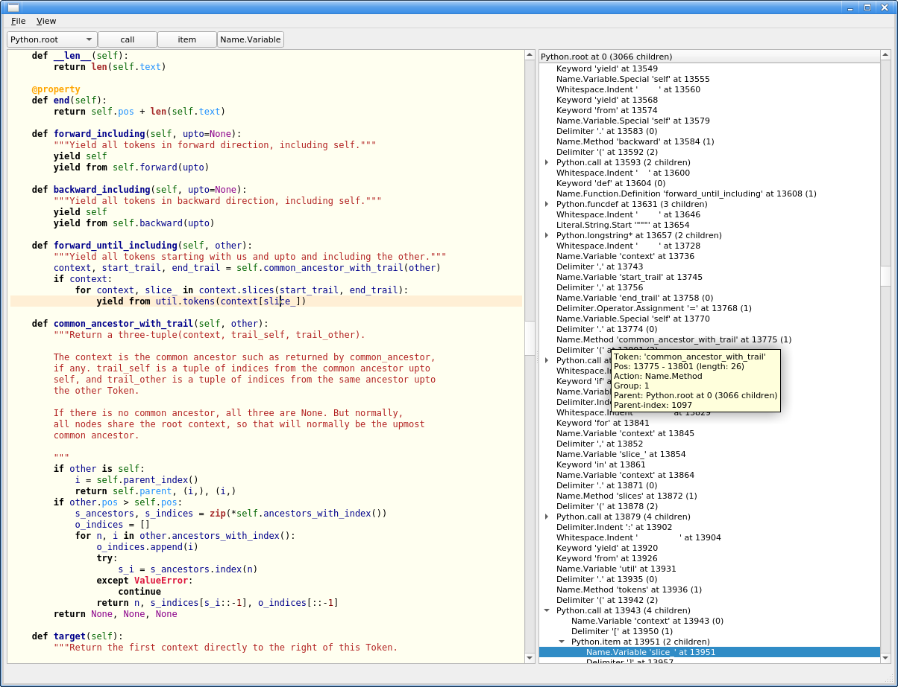

.. include:: ../../README.rst

   A screenshot of the debugger included with *parceqt*

This manual documents *parce* version |release|.

.. toctree::
   :maxdepth: 2
   :caption: Contents:

   overview.rst
   gettingstarted.rst
   deflanguage.rst
   treestructure.rst
   building.rst
   doc.rst
   transforming.rst

   langs.rst
   stdactions.rst
   modoverview.rst

.. toctree::
   :hidden:
   :maxdepth: 1
   :caption: Extra links:

   parce@Github <https://github.com/wbsoft/parce>
   parce@PyPi <https://pypi.org/project/parce/>
   parce for Qt <https://parce.info/parceqt>

Indices and tables
==================

* :ref:`genindex`
* :ref:`modindex`
* :doc:`changelog`
* :doc:`license`
